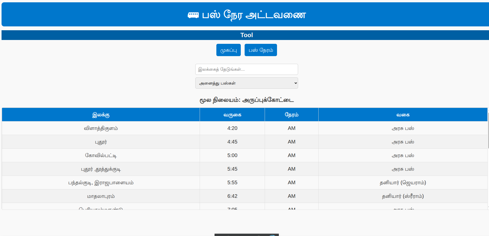

🚌 Aruppukottai Bus Timings

[👉 View Live Website](https://moorthid2023.github.io/aruppukottai_buses/)

A simple Tamil web application to view and manage bus timings from Aruppukottai to various destinations.
Built using HTML, CSS, and JavaScript with no external dependencies.

🚀 Features
🔹 index.html (Main App)

View all buses departing from Aruppukottai

Search by destination (supports partial matches, e.g. "புதூர்" will match "புதூர்" and "புதூர் ,தூத்துக்குடி")

Filter by type:

🟢 அரசு பஸ் (Government)

🔵 தனியார் பஸ் (Private)

Click a destination → See all matching buses in detail

Expand/collapse bus route

Mobile responsive design

🔹 tool.html (JSON Tool)

Upload an existing bustiming.json

Add, edit, or delete buses via a simple form

Choose destination from a dropdown (or enter a new one)

Automatically formats time into 12-hour (AM/PM) format for the main app

Export updated JSON by:

📋 Copying to clipboard

⬇️ Downloading as bustiming.json

🔹 bustiming.json

Stores bus data in the following format:

[
  {
    "destination": "புதூர்",
    "arrival": "07:30",
    "period": "AM",
    "type": "govt",
    "operator": "",
    "route": "அருப்புக்கோட்டை → புதூர்"
  },
  {
    "destination": "புதூர் ,தூத்துக்குடி",
    "arrival": "09:15",
    "period": "AM",
    "type": "private",
    "operator": "XYZ Travels",
    "route": "அருப்புக்கோட்டை → புதூர் → தூத்துக்குடி"
  }
]

📂 Project Structure
.
├── index.html       # Main bus timing UI
├── tool.html        # JSON editor tool
└── bustiming.json   # Bus data

🔧 How to Run Locally

Clone this repository:

git clone https://github.com/moorthid2023/aruppukottai_buses.git
cd aruppukottai_buses

Open index.html in your browser to view bus timings.

Open tool.html in your browser to manage bustiming.json.

Replace the bustiming.json file in the root with your exported one from the tool.

🌟 Future Improvements

Add sorting by arrival time

Add dark mode

Convert into a Progressive Web App (PWA) for offline support

Host as a public website (GitHub Pages / Netlify)

📝 License

This project is open-source. Feel free to use and modify.